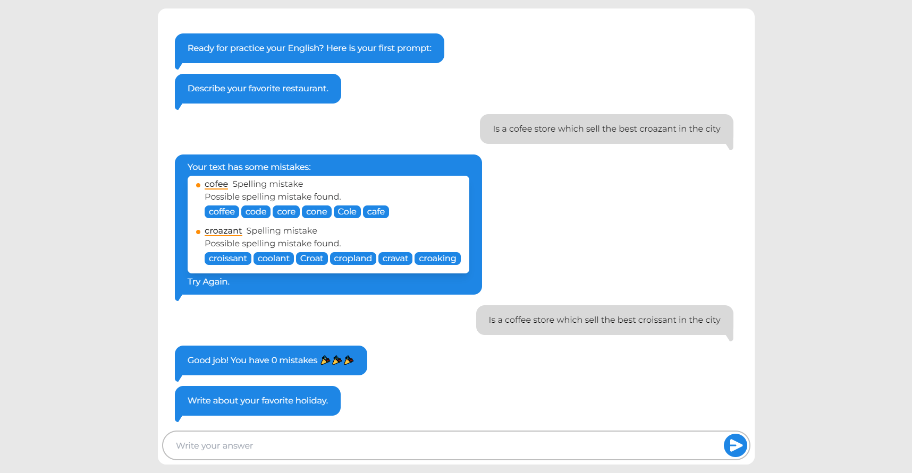

# Jeenglish - Practice your writing skills every day

## General Info

Jeenglish gives you instant feedback on your response to writing prompts. Fast feedback is important for learning fast. Use Jeenglish for at least 5 minutes a day and see your English improve.

### Screenshot


## Coming soon

### 📘 Hover dictionary:
Hover over an unknown word and get its meaning. This feature will help you to improve your vocabulary.

### ⚔ Difficulties:
Choose how hard you want the prompts to be and increase the minimum valid size of your answer, pushing yourself to improve.

## Coming not so soon


### Speaking Practice:
Read a phrase and get feedback about your pronunciation. With this, you can practice your hard skills (writing and speaking) in Jeenglish.

## Technologies


* [Next.js](https://nextjs.org/): v 18.2.0
* [React](https://react.dev/): v 2.34
* [TailwindCSS](https://tailwindcss.com/) : v 3.3.1
* [Typescript](https://www.typescriptlang.org/):  v 5.0.4
* [Supabase JS client](https://supabase.com/): v 2.21.0


## Installation

If you want to download this repository, follow these command lines.
``` bash
git clone https://github.com/JhonnGutierrez/Jeenglish.git
cd jeenglish
npm install
npm supabase-types
npm dev
```

> This project exists thanks to the [LanguageTool Proofreading API](https://languagetool.org/proofreading-api)